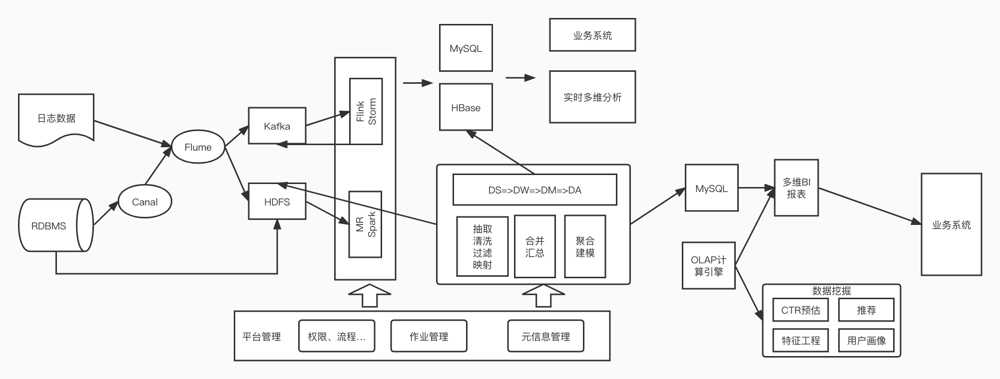

# 毕业设计
## 题目一: 分析一条 TPCDS SQL
分析一条 TPCDS SQL（请基于 Spark 3.1.1 版本解答）
- 运行该 SQL，如 q38，并截图该 SQL 的 SQL 执行图
- 该 SQL 用到了哪些优化规则（optimizer rules）
- 请各用不少于 200 字描述其中的两条优化规则
- SQL 从中任意选择一条：  
  [https://github.com/apache/spark/tree/master/sql/core/src/test/resources/tpcds](https://github.com/apache/spark/tree/master/sql/core/src/test/resources/tpcds)

帮助文档：如何运行该 SQL：
```
1. 从 github 下载 TPCDS 数据生成器
git clone https://github.com/maropu/spark-tpcds-datagen.git
cd spark-tpcds-datagen

2. 下载 Spark3.1.1 到 spark-tpcds-datagen 目录并解压
wget https://archive.apache.org/dist/spark/spark-3.1.1/spark-3.1.1-bin-hadoop2.7.tgz
tar -zxvf spark-3.1.1-bin-hadoop2.7.tgz

3. 生成数据
mkdir -p tpcds-data-1g
export SPARK_HOME=./spark-3.1.1-bin-hadoop2.7
./bin/dsdgen --output-location tpcds-data-1g

4. 下载三个 test jar 并放到当前目录
wget https://repo1.maven.org/maven2/org/apache/spark/spark-catalyst_2.12/3.1.1/spark-catalyst_2.12-3.1.1-tests.jar
wget https://repo1.maven.org/maven2/org/apache/spark/spark-core_2.12/3.1.1/spark-core_2.12-3.1.1-tests.jar
wget https://repo1.maven.org/maven2/org/apache/spark/spark-sql_2.12/3.1.1/spark-sql_2.12-3.1.1-tests.jar

5. 执行 SQL
./spark-3.1.1-bin-hadoop2.7/bin/spark-submit --class org.apache.spark.sql.execution.benchmark.TPCDSQueryBenchmark --jars spark-core_2.12-3.1.1-tests.jar,spark-catalyst_2.12-3.1.1-tests.jar spark-sql_2.12-3.1.1-tests.jar --data-location tpcds-data-1g --query-filter "q73"
```

### 执行结果：该SQL用到如下优化规则
```
org.apache.spark.sql.catalyst.optimizer.ColumnPruning
org.apache.spark.sql.catalyst.optimizer.ReplaceIntersectWithSemiJoin
org.apache.spark.sql.catalyst.optimizer.ReplaceDistinctWithAggregate
org.apache.spark.sql.catalyst.optimizer.ReorderJoin
org.apache.spark.sql.catalyst.optimizer.PushDownPredicates
org.apache.spark.sql.catalyst.optimizer.PushDownLeftSemiAntiJoin
org.apache.spark.sql.catalyst.optimizer.CollapseProject
org.apache.spark.sql.catalyst.optimizer.EliminateLimits
org.apache.spark.sql.catalyst.optimizer.ConstantFolding
org.apache.spark.sql.catalyst.optimizer.RemoveNoopOperators
org.apache.spark.sql.catalyst.optimizer.InferFiltersFromConstraints
org.apache.spark.sql.catalyst.optimizer.RewritePredicateSubquery
```
### 选择PushDownPredicates 和 ReorderJoin 这两条规则
- PushDownPredicates 这个规则通过其他的操作把 filter 操作下推到离数据源更近的地方，将计算转移至数据源端，减少 spark 加载和计算的数据量，但不是所有的操作都支持。

- ReorderJoin 这个规则是对 Join 操作进行重新排列，有两种做法。一种是逻辑上的转换，即将在 where 中涉及到两个表关联或者 filter 的条件提前至相应的 join 操作中，减少参与 join 的数据量以及最终 join 结果的数据量。还有一种做法是基于成本的做法，通过启用成本优化器，以及对 join 的表进行统计，spark 会根据 join 的成本选择代价最小的 join 方式。

## 题目二：架构设计题
你是某互联网公司的大数据平台架构师，请设计一套基于 Lambda 架构的数据平台架构，要求尽可能多的把课程中涉及的组件添加到该架构图中。并描述 Lambda 架构的优缺点，要求不少于 300 字。

### 架构图


### 什么是 Lambda 架构
**Lambda 架构是一种数据处理架构**，通过利用**批处理和流处理**方法来处理大量数据。这种架构方法通过使用离线批处理来提供批处理数据的全面和准确的视图，同时使用实时流处理来提供在线数据的视图来平衡延迟、吞吐量和容错性，两个视图输出可以在呈现之前合并。

Lambda 架构的兴起与**大数据的增长、实时分析以及减少延迟**的驱动力相关。

流处理计算的指标批处理也会计算，最终以批处理为准，即每一次批处理计算之后的结果会覆盖流处理的结果，这是对流处理引擎的一种补充方式（实时计算的结果一般来说没有离线计算的准确）。

Lambda 架构包含三层，分别是 **Batch Processing Layer（批处理层）、Speed (Real-Time) Processing Layer（速度处理层）、Serving Layer（服务层）**。

### 为什么有 Lambda 架构
#### 业务背景一
无人车、无人机的数据需要实时检测，如果遇到突发事件我们可以通过工作人员紧急制动，但是为了事后可以分析故障，我们还需要根据历史数据来做进一步决策

#### 业务背景二
广告投放业务，在广告投放的业务需求下，不仅需要流处理及时响应用户的浏览策略还需要事后分析用户的历史网站访问行为，这就又需要批处理系统来计算。因为用户 B 可能暂时借用用户 A 的手机刷自己喜欢的抖音、微博等，导致广告投放有一定的偏差

### Lambda 优缺点
#### 优点
Lambda 架构的好处就是架构比较简单
对数据修正纠错也很友好，如果后期数据统计口径发生了变化，可以通过重新运行离线任务，从而很快的将历史数据修正纠错为最新的口径

#### 缺点
同样的需求需要开发两套一样的代码，一个是批处理引擎实现，一个是流处理引擎实现，后期维护困难，如果需求变更则需要更改两套代码，独立测试结果，且两个作业需要同步上线  
资源占用增多，同样的逻辑需要计算两次  
离线链路和实时链路数据差异会让业务方困惑，批量和实时的数据结果有时不对应
